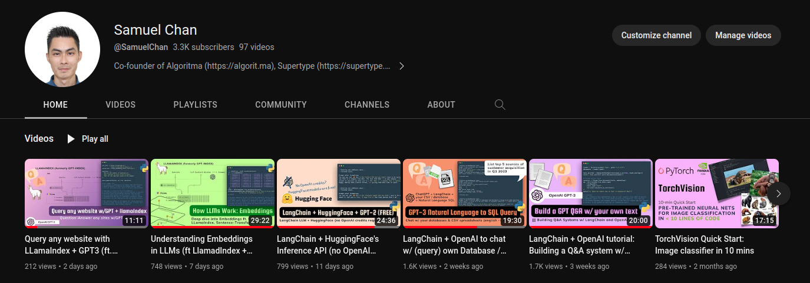

# llm-python
A set of instructional materials, code samples and Python scripts featuring LLMs (GPT etc) through interfaces like llamaindex, langchain, Chroma, Alpaca etc. Mainly used to store reference code for my LangChain tutorials on YouTube.

<!--  -->


Learn LangChain from my YouTube channel:
- Part 1: [LangChain + OpenAI tutorial: Building a Q&A system w/ own text data](https://youtu.be/DYOU_Z0hAwo)
- Part 2: [LangChain + OpenAI to chat w/ (query)  own Database / CSV](https://youtu.be/Fz0WJWzfNPI)  
- Part 3: [LangChain + HuggingFace's Inference API (no OpenAI credits required!)](https://youtu.be/dD_xNmePdd0)
- Part 4: [Understanding Embeddings in LLMs](https://youtu.be/6uyBc0jm1xQ)
- Part 5: [Query any website with LLamaIndex + GPT3 (ft. Chromadb, Trafilatura)](https://youtu.be/6K1lyyzpxtk)
- Part 6: [Locally-hosted, offline LLM w/LlamaIndex + OPT (open source, instruction-tuning LLM)](https://youtu.be/qAvHs6UNb2k)

### Quick Start
1. Clone this repo
2. Install requirements: `pip install -r requirements.txt`
3. Some sample data are provided to you in the `news` foldeer, but you can use your own data by replacing the content (or adding to it) with your own text files.
4. Create a `.env` file which contains your OpenAI API key. You can get one from [here](https://beta.openai.com/). The `.env` file should look like this:
```
OPENAI_API_KEY=your_api_key_here
HUGGINGFACEHUB_API_TOKEN=your_api_token_here
```
HuggingFace is optional but is recommended if you want to use the Inference API and explore those models outside of the OpenAI ecosystem. This is demonstrated in Part 3 of the tutorial series. 
5. Run the examples in any order you want. For example, `python 6_team.py` will run the website Q&A example, which uses GPT-3 to answer questions about a company and the team of people working at Supertype.ai. Watch the corresponding video to follow along each of the examples.
