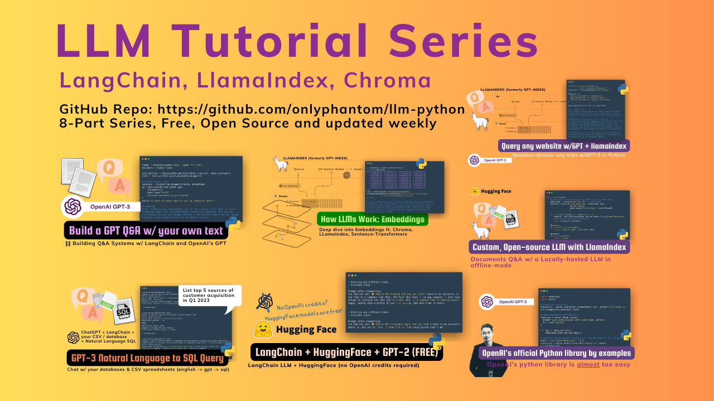

# llm-python
A set of instructional materials, code samples and Python scripts featuring LLMs (GPT etc) through interfaces like llamaindex, langchain, Chroma (Chromadb), Pinecone etc. Mainly used to store reference code for my LangChain tutorials on YouTube. 

<!--  -->


Learn LangChain from my YouTube channel (~8 hours of LLM hands-on building tutorials); Each lesson is accompanied by the corresponding code in this repo and is designed to be self-contained -- while still focused on some key concepts in LLM (large language model) development and tooling. 

Feel free to pick and choose your starting point based on your learning goals:

| Part | LLM Tutorial | Link | Video Duration |
| --- | --- | --- | --- |
| 1 | OpenAI tutorial and video walkthrough | [Tutorial Video](https://youtu.be/skw-togjY7Q) | 26:56 |
| 2 | LangChain + OpenAI tutorial: Building a Q&A system w/ own text data | [Tutorial Video](https://youtu.be/DYOU_Z0hAwo) | 20:00 |
| 3 | LangChain + OpenAI to chat w/ (query)  own Database / CSV | [Tutorial Video](https://youtu.be/Fz0WJWzfNPI) | 19:30 |
| 4 | LangChain + HuggingFace's Inference API (no OpenAI credits required!) | [Tutorial Video](https://youtu.be/dD_xNmePdd0) | 24:36 |
| 5 | Understanding Embeddings in LLMs | [Tutorial Video](https://youtu.be/6uyBc0jm1xQ) | 29:22 |
| 6 | Query any website with LLamaIndex + GPT3 (ft. Chromadb, Trafilatura) | [Tutorial Video](https://youtu.be/6K1lyyzpxtk) | 11:11 |
| 7 | Locally-hosted, offline LLM w/LlamaIndex + OPT (open source, instruction-tuning LLM) | [Tutorial Video](https://youtu.be/qAvHs6UNb2k) | 32:27 |
| 8 | Building an AI Language Tutor: Pinecone + LlamaIndex + GPT-3 + BeautifulSoup | [Tutorial Video](https://youtu.be/k8G1EDZgF1E) | 51:08 |
| 9 | Building a queryable journal 💬 w/ OpenAI, markdown & LlamaIndex 🦙 | [Tutorial Video](https://youtu.be/OzDhJOR5IfQ) | 40:29 |
| 10 | Making a Sci-Fi game w/ Cohere LLM + Stability.ai: Generative AI tutorial | [Tutorial Video](https://youtu.be/uR93yTNGtP4) | 1:02:20 |
| 11 | GPT builds entire party invitation app from prompt (ft. SMOL Developer) | [Tutorial Video](https://www.youtube.com/watch?v=Ll_VIsIjuFg) | 41:33 | 
| 12 | A language for LLM prompt design: Guidance | [Tutorial Video](https://youtu.be/k4Ejc3bLQiU) | 43:15 | 


The full lesson playlist can be found [here](https://www.youtube.com/playlist?list=PLXsFtK46HZxUQERRbOmuGoqbMD-KWLkOS).

### Quick Start
1. Clone this repo
2. Install requirements: `pip install -r requirements.txt`
3. Some sample data are provided to you in the `news` foldeer, but you can use your own data by replacing the content (or adding to it) with your own text files.
4. Create a `.env` file which contains your OpenAI API key. You can get one from [here](https://beta.openai.com/). `HUGGINGFACEHUB_API_TOKEN` and `PINECONE_API_KEY` are optional, but they are used in some of the lessons.
    - [Lesson 10](./11_worldbuilding.py) uses Cohere and Stability AI, both of which offers a free tier (no credit card required). You can add the respective keys as `COHERE_API_KEY` and `STABILITY_API_KEY` in the `.env` file.

The `.env` file should look like this:
```
OPENAI_API_KEY=your_api_key_here

# optionals (not required for most of the series)
HUGGINGFACEHUB_API_TOKEN=your_api_token_here
PINECONE_API_KEY=your_api_key_here
```
HuggingFace and Pinecone are optional but is recommended if you want to use the Inference API and explore those models outside of the OpenAI ecosystem. This is demonstrated in Part 3 of the tutorial series. 
5. Run the examples in any order you want. For example, `python 6_team.py` will run the website Q&A example, which uses GPT-3 to answer questions about a company and the team of people working at Supertype.ai. Watch the corresponding video to follow along each of the examples.

### Dependencies
As LlamaIndex and LangChain are both very new projects, if you're using the latest version of these libraries, some of the code in this repo may need small adjustment. I will try to keep this repo up to date with the latest version of the libraries, but if you encounter any issues, please let me know. The code examples are tested on LlamaIndex 0.5.7 and LangChain 0.0.157.

### Mentorship and Support
I run a mentorship program under [Supertype Fellowship](https://fellowship.supertype.ai). The program is self-paced and free, with a community of other learners and practitioners around the world (English-speaking). You can optionally book a 1-on-1 session with my team of mentors to help you through video tutoring and code reviews.
